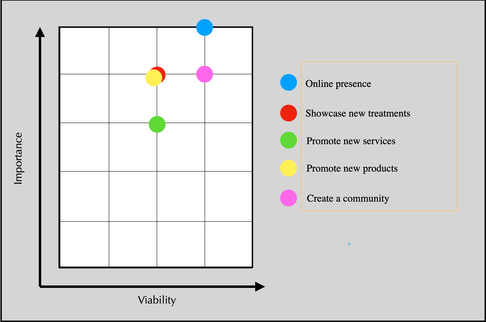
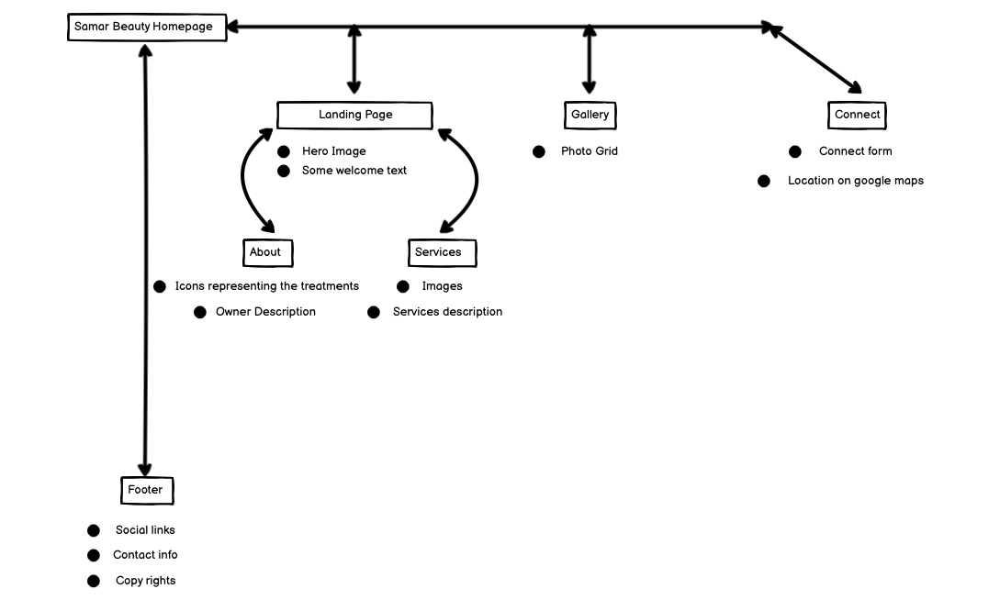

# Samar Beauty


## Table of contents

1. [Introduction](#introduction)
2. [HowToUse](#how-to-use)
3. [IssuesAndBugs](#issues-and-bugs)
4. [TechnologiesUsed](#technologies-used)
5. [Deployment](#deployment)
6. [Credits](#credits) 
 
---

# Project Description

Samar Beauty is a website for the modern women and men who wants to take care of their skin and renew their youth cells.
it's a website with various treatments and servecis to help the customers to take care of their skin and body.
Samar is a professional, experienced and licensened dermathologist with more than 15 years of practice.

This is the first of four Milestone Projects that the developer must complete during their Full Stack Web Development Program at The Code Institute.

The main requirements were to make a responsive and static website with a minimum of three pages using primarily **HTML5** and **CSS3**.


[Back to top ⇧](#Samar-Beauty)

## How To Use 

### Structure

This is a 3 pages website.
1. The first page is the home page and it has 3 sections
    1. The HOME section and the introduction image with some paragraphes.
    2. The ABOUT section where it gives some description regarding the business owners and their expertise.
    3. The SERVICE section where it shows the different services that the website has to offer.
2. The second page is a GALLERY that has a mix of pictures taken by the owners of the business to showcase their practical results on clients.
3. The third pasge is a CONNECT page to get info about the potential clients that need to book new sessions or for consultancy, with a map to the business address.

## UX 

### Ideal User Demographic
#### The ideal user of this website is:
- Potential clients
- Current clients
- skin care professionals

### User Stories
#### New/Potential Clients Goals:
1. As a new client, I want to easily navigate through the website to find the relevant content, effortlessly.
2. As a new client, I want to learn more about Samar's background in order to better understand her services.
3. As a new client, I want to easily navigate to Samar's social links in order to keep up with the latest news and offers.
4. As a new client, I want to easily find links to new skin care products.

#### Current Clients Goals:
1. As a current cliens, I want to navigate to information about the newest treatments.
2. As a current client, I want to find out about newest skin care products. 
3. As a current client, I want to easily navigate to Samar's discounted offers and products.

### Development Planes

In order to create a comprehensive and informative website, the developer worked closely with Samar to distinguish the required functionality of the site and how it would answer the user needs, as described above.

#### Strategy
Broken into three categories, the website will focus on the following target audiences:

- **Roles:**
     - Current clients of Samar
     - New clients
     - Skin Care Professionals and dermathologists

- **Demographic:**
     - 15 - 85 year olds (some treatments requires a spesific age to be applied safely)
     - Potential trainees(students, fresh graduates)
     - Professional skin care and dermathologists
     
- **Psychographics:**
     - Personality & Attitudes:
          - Youthful
          - Social
     - Values:
          - More modern lifestyle
     - Lifestyles:
          - Beauty 
          - Interested in the "modern beauty"

The website needs to enable the **user** to:
- Retrieve desired information:
     - Services
     - New products
     - Upcoming discounts and new treatments
     - Contact information


The website needs to enable the **Dermathologist** to:
- Develop an online presence 
- Provide an easily navigable website for users to find relevant information:
     - New products
     - Treatments informations
- Provide a channel of communication for new and current clients (Social Links - easily accessible throughout the site)

With these goals in mind, a strategy table was created to determine the trade-off between importance and viability with the following results:



#### Scope
A scope was defined in order to clearly identify what needed to be done in order to align features with the strategy previously defined. This was broken into two categories:
- **Content Requirements**
     - The user will be looking for:
          - General information
          - New treatments
          - Discounted products
          - Contact details
          - Social Links
- **Functionality Requirements**
     - The user will be able to:
          - Easily navigate through the site in order to find the information they want
          - Be able to find links to external sites in order to:
               - Purchase products
               - Find the salon directions
               - Book a time for a treatment

#### Structure
The information architecture was organized in a **hierarchial tree structure** in order to ensure that users could navigate through the site with ease and efficiency, with the following results: 



### Skeleton 

Wireframe mockups were created in a [Balsamiq]((https://balsamiq.com/)

Website :


[Back to top ⇧](#Samar-Beauty)

### Design

#### Colour Scheme
The main colours used throughout the website are a mixture of purple and White, with pink accents.
The chosen colour scheme is a reflection of the soft beauty look and feel.

#### Typography
The pairing of the fonts ['Source Sans Pro'](https://fonts.google.com/specimen/Source+Sans+Pro?query=Source+Sans+Pro#standard-styles "Link to 'Source Sans Pro' Google Font")is used throughout the website with Sans Serif as the fallback font in case of import failure. 

#### Imagery
The selected imagery is reflecting the real results that to be expected.

The imagery is catching and visually represents the theme of the website.

[Back to top ⇧](#Samar-Beauty)

## Features
### Design Features
Each page of the website features a consistent responsive navigational system:
- The **Header** contains a conventionally placed **logo** in the top left of the page (whereby by clicking this will redirect users back to the home page) and **navigation bar** in the top right of the page.
- On smaller screens, the navigation bar collapses into a **toggler** icon whereby clicking it will reveal the navigation .

<dl>
  <dt><a href="index.html" target="_blank" alt="Samar-Beauty">Home Page</a></dt>
  <dd>The Home Page is divided into three columns wide on desktops and one column or two on mobile and tablet devices:
     <ul>
          <li><strong>Hero Image</strong> - Occupying 100% of the page width and height on all devices, The imagery used was specifically chosen as it created a impactful first impression, setting the tone of the website for the users.
          </li>
           <li><strong>Text</strong> - On the top right side and the botoom, while viewing on a desktop. On mobile and tablet devices, the text becomes stacked, on the <strong>Hero Image</strong> and keeps getting smaller untill it becomes invisible on certain device size.This style was chosen in order to draw the users attention to the information straight away. In this, there is a <strong>Connect</strong> button linking to the connect page where users can fill the form to be contacted.
          </li>
     </ul>
  </dd>
  <dt><a href="gallery.html" target="_blank" alt="Samar-Beauty-Gallery">Gallery Page</a></dt>
  <dd>The gallery page structurally similar to the other pages with three columns, providing a uniformed and consistent look for aesthetic purposes:
     <ul> 
          <li><strong>Gallery Grid</strong> - Occupying 100% of the page width while viewing on a desktop. On mobile and tablet devices, the image becomes stacked occupying 100% of the page width as one column.
          </li>
     </ul>
</dd>
<dt><a href="connect.html" target="_blank" alt="Samar-Beauty-Connect">Connect Page</a></dt>
  <dd> on all devices the connect page has a <strong>contact form</strong> that is fixed and unmoving as the user scrolls through the page, with a <strong>google map</strong> showing the location of the salon.
  </dd>
</dl>

### Existing Features
- **Header Logo** - Appearing on every page for brand recognition. Clicking the logo will return the users to the home page, as expected.
- **Header Navigation Bar** - Appearing on every page for a consistently easy and intuitive navigable system.
- **Social Icons** - Appearing on every page, the icons are appropriate representations of the Social Media platforms, linking users to Samar's page on each.
- **Call To Action buttons** - Appearing on every page, excluding the Bio Page. Maintaining a consistent and uniform design throughout the page. Clicking the buttons will send users to external sites for various purposes:
     - Google maps for locaion
     - Social media websites
- **Google Maps Embed** - iframe embedding of Google maps, showing the location of the salon on the connect Page. The map is omitted from small devices in order to ensure the readability of the page on mobile devices.
- **Contact Form** - A contact form is used in the connect  page, in order to provide a point of contact for the user. The form is not validated.

### Features to Implement in the future
- **Merchandise Shop**
     - **Feature** - set up an shop where Samar can sell their products directly to clients online.
     - **Reason for not featuring in this release** - JavaScript needed to implement.

[Back to top ⇧](#Samar-Beauty)

## Issues and Bugs 
The developer ran into a number of issues during the development of the website, with the noteworthy ones listed below, along with solutions or ideas to implement in the future.

**Navbar Bug** - A bug with the Navigation bar. the navbar wasn't taking effect the color set by the developer. While searching on the web if someone had the same issue, the developer found on [Stack Overflow](https://stackoverflow.com/questions/46237610/bootstrap-4-navbar-color-wont-change "Link to Stack Overflow solution") a similar problem with a solution that he implemented and fixed the bug.

**Hero Image Issue - Home Page** - A bug was detected while styling the hero image where the image wasn't taking the position properly, while searching the web to see if someon else had the same ussue the developer found a solution posted on  [Stack Overflow](https://stackoverflow.com/questions/26236486/background-size-cover-not-working "Link to Stack Overflow solution") that helped to fix the bug.

**Google Maps iFrame Issue (Live Page)** - A bug found with the iframe element of the connect page (which was used to implement a Google Maps embed). There was a problem with the responsiveness of the iframe, caused the map to extend over the specified width. while `overflow: hidden;` would have worked with larger screens, it didn't work well on smaller screens. The developer found a post on [Digital Inspiration](https://www.labnol.org/internet/embed-responsive-google-maps/28333/ "Link to Digital Inspiration solution") that helped to understand the problem and to successfully implement a solution.

[Back to top ⇧](#Samar-Beauty)

## Technologies Used

### Main Languages Used

1. [HTML5](https://en.wikipedia.org/wiki/HTML5 "Link to HTML Wiki")
2. [CSS3](https://en.wikipedia.org/wiki/Cascading_Style_Sheets "Link to CSS Wiki")

### Frameworks, Libraries & Programs Used
1. [Bootstrap](https://getbootstrap.com/docs/4.4/getting-started/introduction/ "Link to Bootstrap page")
     - Bootstrap was used to implement the responsiveness of the site, using bootstrap classes.
2. [Google Fonts](https://fonts.google.com/ "Link to Google Fonts")
    - Google fonts was used to import the fonts "Roboto", "Lato" and "Montserrat" into the style.css file. These fonts were used throughout the project.
3. [Font Awesome](https://fontawesome.com/ "Link to FontAwesome")
     - Font Awesome was used on all pages throughout the website to import icons (e.g. social media icons) for UX purposes.
4. [Git](https://git-scm.com/ "Link to Git homepage")
     - Git was used for version control by utilizing the GitPod terminal to commit to Git and push to GitHub.
5. [GitHub](https://github.com/ "Link to GitHub")
     - GitHub was used to store the project after pushing
6. [Balsamiq](https://balsamiq.com/ "Link to balsamiq homepage")
     - Figma was used to create the wireframes during the design phase of the project.
7. [Am I Responsive?](http://ami.responsivedesign.is/# "Link to Am I Responsive Homepage")
     - Am I Responsive was used in order to see responsive design throughout the process and to generate mockup imagery to be used.

[Back to top ⇧](#Samar-Beauty)

## Testing

Testing information can be found in a separate testing [file](TESTING.md "Link to testing file")

## Deployment

This project was developed using [GitPod](https://www.gitpod.io "Link to Visual Studio Code site"), committed to git and pushed to GitHub using the computer terminal.

### Deploying on GitHub Pages
To deploy this page to GitHub Pages from its GitHub repository, the following steps were taken:

1. Log into [GitHub](https://github.com/login "Link to GitHub login page") or [create an account](https://github.com/join "Link to GitHub create account page").
2. Locate the [GitHub Repository](https://github.com/11zouzou11/Samar-Beauty "Link to GitHub Repo").
3. At the top of the repository, select Settings from the menu items.
4. Scroll down the Settings page to the "GitHub Pages" section.
5. Under "Source" click the drop-down menu labelled "None" and select "Master Branch".
6. Upon selection, the page will automatically refresh meaning that the website is now deployed.
7. Scroll back down to the "GitHub Pages" section to retrieve the deployed link.
8. At the time of submitting this Milestone project the Development Branch and Master Branch are identical.

### Forking the Repository
By forking the GitHub Repository we make a copy of the original repository on our GitHub account to view and/or make changes without affecting the original repository by using the following steps...

1. Log into [GitHub](https://github.com/login "Link to GitHub login page") or [create an account](https://github.com/join "Link to GitHub create account page").
2. Locate the [GitHub Repository](https://github.com/11zouzou11/Samar-Beauty "Link to GitHub Repo").
3. At the top of the repository, on the right side of the page, select "Fork"
4. You should now have a copy of the original repository in your GitHub account.

### Creating a Clone
How to run this project locally:
1. Install the [GitPod Browser](https://www.gitpod.io/docs/browser-extension/ "Link to Gitpod Browser extension download") Extension for Chrome.
2. After installation, restart the browser.
3. Log into [GitHub](https://github.com/login "Link to GitHub login page") or [create an account](https://github.com/join "Link to GitHub create account page").
2. Locate the [GitHub Repository](https://github.com/11zouzou11/Samar-Beauty "Link to GitHub Repo").
5. Click the green "GitPod" button in the top right corner of the repository.
This will trigger a new gitPod workspace to be created from the code in github where you can work locally.

How to run this project within a local IDE, such as VSCode:

1. Log into [GitHub](https://github.com/login "Link to GitHub login page") or [create an account](https://github.com/join "Link to GitHub create account page").
2. Locate the [GitHub Repository](https://github.com/11zouzou11/Samar-Beauty "Link to GitHub Repo").
3. Under the repository name, click "Clone or download".
4. In the Clone with HTTPs section, copy the clone URL for the repository.
5. In your local IDE open the terminal.
6. Change the current working directory to the location where you want the cloned directory to be made.
7. Type 'git clone', and then paste the URL you copied in Step 3.
```
git clone https://github.com/USERNAME/REPOSITORY
```
8. Press Enter. Your local clone will be created.

Further reading and troubleshooting on cloning a repository from GitHub [here](https://docs.github.com/en/free-pro-team@latest/github/creating-cloning-and-archiving-repositories/cloning-a-repository "Link to GitHub troubleshooting")

[Back to top ⇧](#Samar-Beauty)

## Credits 

### Content
- The text used is written by the beauty artist Samar.

## Code 

The following sites were used on a more regular basis to help implement and build this responsive website : 

- [Stack Overflow](https://stackoverflow.com/ "Link to Stack Overflow page")
- [W3Schools](https://www.w3schools.com/ "Link to W3Schools page")
- [Bootstrap](https://getbootstrap.com/ "Link to BootStrap page"
- [Google](https://www.google.com/ "Link to Google page)
- [Youtube](https://www.youtube.com/ "Link to Youtube page)


- Note:
1. the video contect were used to get a better understanding of the elements and everything got modified to meet the websites goals. 
2. all the code that has been borrowed is credited within the html code.

[Back to top ⇧](#Samar-Beauty)