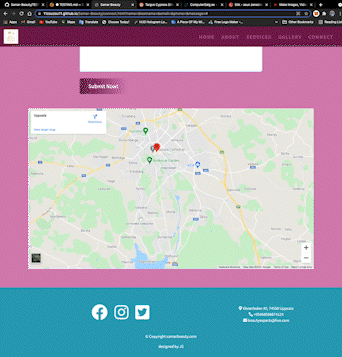
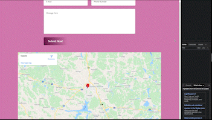
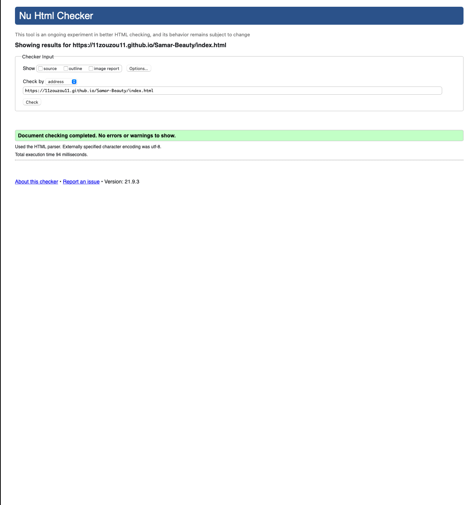
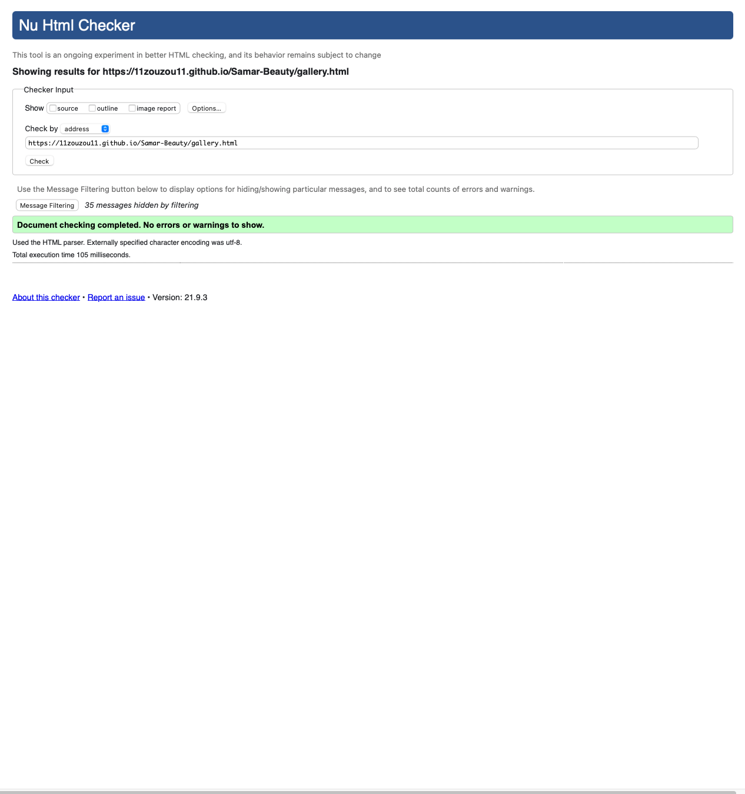
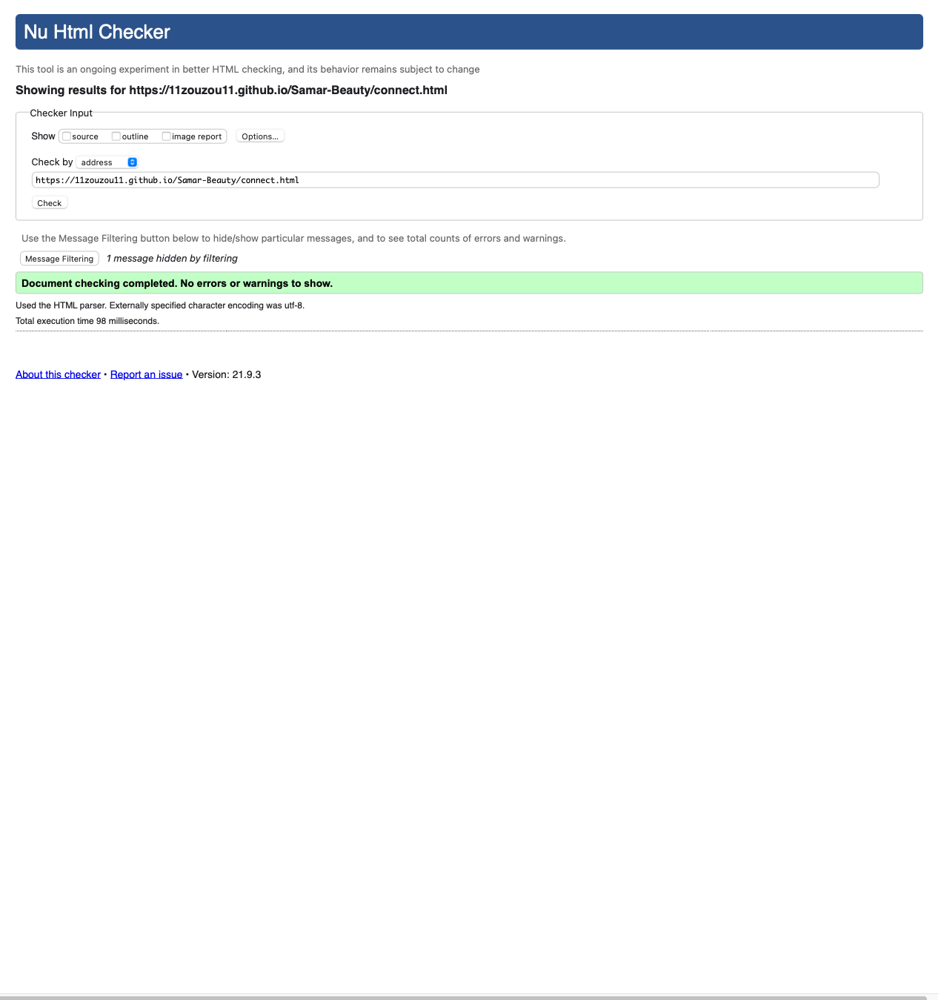
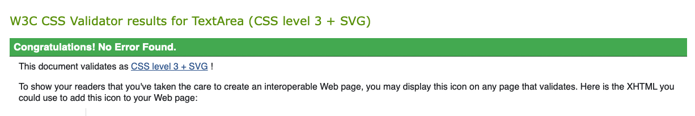

# Samar Beauty - Testing 

[Main README.md file](/README.md)

[View live project](https://11zouzou11.github.io/Samar-Beauty/)

[View website in GitHub Pages](https://github.com/11zouzou11/Samar-Beauty)

***
## Table of contents
1. [Testing User Stories](#Testing-User-Stories)
2. [Manual Testing](#Manual-Testing)
3. [Automated Testing](#Automated-Testing) 
     - [Code Validation](#Code-Validation)
     - [Browser Validation](#Browser-Validation)
     - [Lighthouse Auditing](#Lighthouse-Auditing)
4. [User Testing](#User-Testing)

***

### User Stories

#### New/Potential Clients Goals:
1. As a new client, I want to easily navigate through the website to find the relevant content, effortlessly.
2. As a new client, I want to learn more about Samar's background in order to better understand her services.
3. As a new client, I want to easily navigate to Samar's social links in order to keep up with the latest news and offers.
4. As a new client, I want to easily find links to new skin care products.

#### Current Clients Goals:
1. As a current cliens, I want to navigate to information about the newest treatments.
2. As a current client, I want to find out about newest skin care products. 
3. As a current client, I want to easily navigate to Samar's discounted offers and products.

[Back to top ⇧](#Samar-Beauty---Testing)

## Manual Testing

### Common Elements Testing
Manual testing was conducted on the following elements that appear on every page:

- Hovering over the Navbar will trigger `hover` effect, confirming the link the users are on

    

- Hovering over Social links will trigger `hover` effect and clicking on them will open a new tab

     Facebook:

     

     Instagram:

     

     Twitter:

     

### Home Page
Manual testing was conducted on the following elements of the [Home Page](index.html):

- Clicking logo on left of screen will refresh the landing page

     

- Hovering over 'Book Today!' link will create a `hover` effect and redirect to the connect page

     

- The responsiveness of the Home page

     

### Gallery Page
Manual testing was conducted on the following elements of the [Gallery Page](gallery.html):

- Clicking the logo on the top left of the page will return the user to the Home Page

     

- The responsiveness of the Gallery page

     

- Clicking on a photo will make it big 

     

### Connect Page
Manual testing was conducted on the following elements of the [Connect Page](connect.html):

- Clicking the logo on the top left of the page will return the user to the Home page

     

- Clicking on the map `iframe` embed will open the map in a new tab

     

- The responsiveness of the Connect page

     

[Back to top ⇧](#Samar-Beauty---Testing)

## Automated Testing

### Code Validation
The [W3C Markup Validator](https://validator.w3.org/) service was used to validate the `HTML` code used.

**Results:**

- Home Page

     

- Gallery Page

     

- Connect Page

     

The [W3C CSS Validator](https://jigsaw.w3.org/css-validator/) service was used to validate the `CSS` coded used.

**Results:**

### Browser Validation
- Chrome - [test image](assets/testing/chrome-test.png)
- Safari - [test image](assets/testing/safari-test.png) 
- Edge - [test image](assets/testing/edge-test.png)1
- Opera - [test image](assets/testing/opera-test.png)
- Firefox - [test image](assets/testing/firefox-test.png)

### Lighthouse Auditing
- Click [here](assets/testing/lighthouse/lighthouse_1.png) for full report
- Click [here](assets/testing/lighthouse/lighthouse_2.mp4) to download .mp4
- No recommendations in this report have been implemented in the first release but will be looked into for future releases.

[Back to top ⇧](#Samar-Beauty---Testing)

## User testing 
Friends and family members were asked to review the site and documentation to point out any bugs and/or user experience issues. Their helpful advice throughout the process led to many UX changes in order to create a better experience. 

It was through this testing that the following changes were made:
- Change to the Navbar background color on mobiles in order for the toggler menu icon to more distinguishable to the background image.
- Change to Navbar font-size on mobile for clearer reading.
- Complete overhaul of Live page in order to display the information in a more user-friendly way.

[Back to top ⇧](#Samar-Beauty---Testing)

***